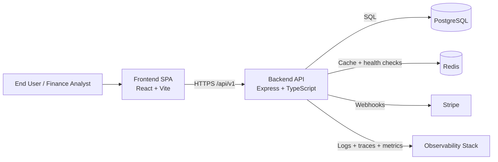
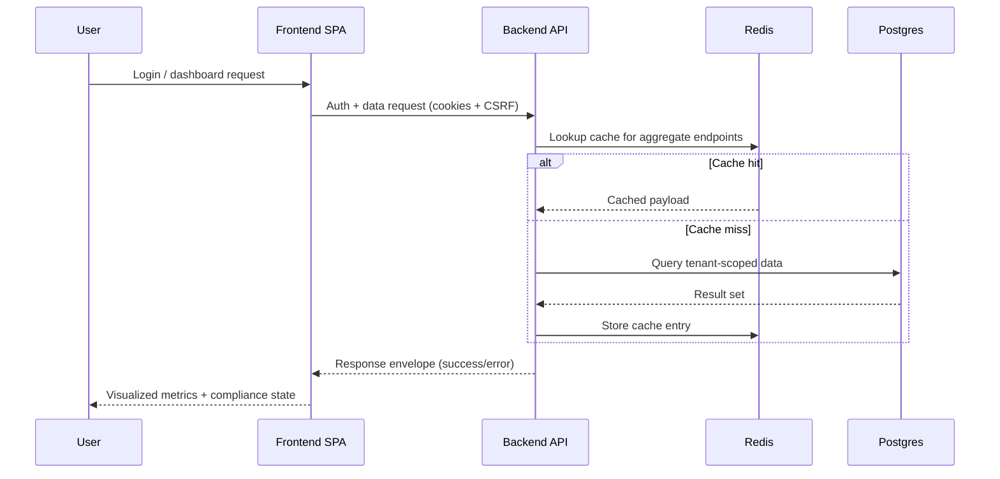
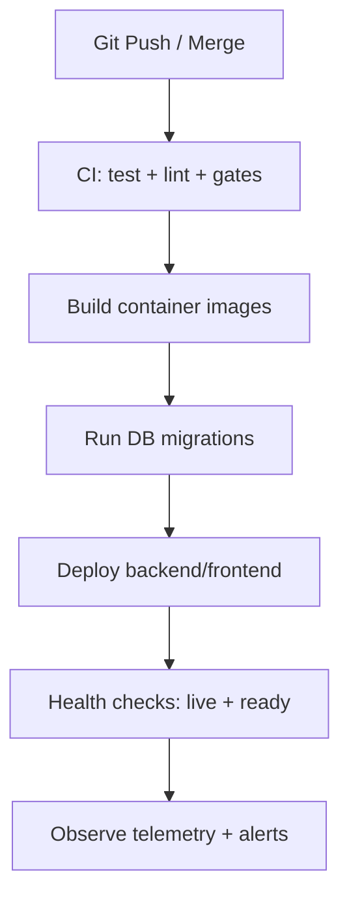

# MedFinance Analytics

A production-oriented healthcare finance intelligence platform for provider organizations and finance teams that need **reliable, explainable, and secure** visibility into cash flow, compliance posture, forecasting, and subscription-driven analytics workflows.

---

## Table of Contents

- [Business Context](#business-context)
- [System Architecture](#system-architecture)
- [Data Flow](#data-flow)
- [Repository Structure](#repository-structure)
- [Backend vs Frontend Responsibilities](#backend-vs-frontend-responsibilities)
- [API Overview](#api-overview)
- [Security Hardening](#security-hardening)
- [Deployment Strategy](#deployment-strategy)
- [Monitoring & Observability](#monitoring--observability)
- [Testing Strategy](#testing-strategy)
- [CI/CD Pipeline](#cicd-pipeline)
- [Performance Strategy](#performance-strategy)
- [Scalability Considerations](#scalability-considerations)
- [Disaster Recovery](#disaster-recovery)
- [Compliance Considerations](#compliance-considerations)
- [Engineering Tradeoffs](#engineering-tradeoffs)
- [Setup & Environments](#setup--environments)
- [Contribution Guidelines](#contribution-guidelines)
- [Future Improvements](#future-improvements)
- [License](#license)

---

## Business Context

Healthcare organizations operate in a constrained environment: volatile reimbursement cycles, strict compliance controls, and operational pressure to optimize margins while maintaining quality of care. MedFinance Analytics addresses this by providing:

- **Financial clarity**: revenue, expenses, cash-flow trends, and KPI summaries.
- **Planning confidence**: historical trend-driven forecasts and budget variance insights.
- **Compliance visibility**: status, alerts, and auditable activity trails.
- **Operational governance**: multi-tenant controls, role-aware access, and billing lifecycle tracking.

### Primary outcomes

| Outcome | Why it matters |
|---|---|
| Faster financial decision-making | Near-real-time dashboards reduce manual spreadsheet cycles |
| Reduced compliance risk | Structured alerts and review trails support accountability |
| Better planning accuracy | Forecasting + variance analytics improve budgeting discipline |
| Enterprise readiness | Security controls and observability support production operations |

---

## System Architecture

MedFinance Analytics is a monorepo containing a React frontend, Express backend, shared TypeScript packages, and infrastructure automation.



### Architectural layers

| Layer | Stack | Responsibilities |
|---|---|---|
| Presentation | React, Vite, TypeScript | Dashboards, auth journeys, charts, API orchestration |
| Application/API | Node.js, Express, TypeScript | Business logic, auth, validation, tenancy, billing |
| Data | PostgreSQL, Redis | Durable data, RLS-aware access patterns, cached aggregates |
| Infra | Docker, Nginx, Render blueprint, scripts | Environment bootstrapping, deployment, migrations, runtime routing |

---

## Data Flow



---

## Repository Structure

| Path | Purpose |
|---|---|
| `apps/frontend` | React SPA and end-to-end frontend tests |
| `apps/backend` | Express API, services, middleware, DB migrations |
| `packages/shared` | Shared types and utility functions |
| `infrastructure` | Dockerfiles, Nginx, Postgres assets, deployment scripts |
| `docs` | Architecture, readiness reviews, security/observability evidence |
| `scripts` | Production and staging quality gates |

---

## Backend vs Frontend Responsibilities

### Frontend (`apps/frontend`)
- Render core product pages (dashboard, financials, compliance, forecasting, billing).
- Manage session-aware API calls with credentialed requests.
- Present chart-based analytics and user-facing status indicators.
- Provide UX guardrails for auth and plan-gated features.

### Backend (`apps/backend`)
- Expose versioned REST APIs under `/api/v1/*`.
- Enforce authentication, authorization, CSRF, rate limits, and request validation.
- Execute business logic for financial analytics, forecasting, compliance, insights, and billing.
- Integrate with PostgreSQL, Redis, and Stripe; centralize error handling and observability instrumentation.

---

## API Overview

### Core conventions

| Convention | Details |
|---|---|
| Base path | `/api/v1` |
| Auth model | HttpOnly access/refresh cookies |
| CSRF model | `csrf_token` cookie echoed as `x-csrf-token` for unsafe methods |
| Response envelope | `success/data` for successful requests, `success/error` for failures |

### Selected endpoints

| Domain | Method | Endpoint | Purpose |
|---|---|---|---|
| Health | GET | `/api/v1/health/live` | Process liveness |
| Health | GET | `/api/v1/health/ready` | Dependency readiness |
| Financials | GET | `/api/v1/financials/summary` | Revenue/expense/net summary |
| Forecasting | GET | `/api/v1/forecasting/forecast` | Trend-based forecast payload |
| Compliance | GET | `/api/v1/compliance/status` | Compliance control status |
| Billing | POST | `/api/v1/billing/subscription` | Create/update Stripe-backed subscription |

### API examples

```bash
# Health readiness
curl -i http://localhost:3001/api/v1/health/ready
```

```bash
# Financial summary (authenticated session cookies assumed)
curl -i "http://localhost:3001/api/v1/financials/summary?year=2026&period=monthly"
```

```bash
# Forecast request
curl -i "http://localhost:3001/api/v1/forecasting/forecast?months=12&metric=revenue"
```

---

## Security Hardening

Security is enforced across transport, application, and data boundaries.

### Controls in place

| Control domain | Implementation |
|---|---|
| Authentication | JWT in HttpOnly cookies with issuer/audience/algorithm checks |
| Session safety | Access + refresh token lifecycle with rotation flows |
| CSRF protection | Token cookie + header validation for unsafe operations |
| API protection | Rate limiting, validation/sanitization middleware, centralized error policy |
| Tenant isolation | Multi-tenant context enforcement and DB-level policy strategy |
| Headers & browser security | Helmet + restrictive CORS policy |
| Auditability | Audit middleware/services and immutable-oriented log strategy |
| Secrets management | Environment-driven secrets for JWT, DB, Redis, Stripe |

---

## Deployment Strategy

### Deployment targets

| Environment | Typical runtime | Purpose |
|---|---|---|
| Local | Node + Docker Compose | Developer iteration and integration testing |
| Staging | Cloud-hosted (Render or equivalent) | Pre-production validation and drills |
| Production | Cloud-hosted with managed DB/Redis | Customer-facing workloads |

### Deployment flow



### Infrastructure notes
- `render.yaml` supports backend + managed PostgreSQL + managed Redis blueprint provisioning.
- `infrastructure/scripts` includes setup, migration, deploy, and backup-oriented helpers.
- Containerized topology supports frontend, backend, Postgres, and Redis for local parity.

---

## Monitoring & Observability

### Observability pillars

| Pillar | Coverage |
|---|---|
| Logs | Request logs, contextual metadata, error stacks |
| Metrics | Route health, dependency readiness, business performance signals |
| Traces | Request path instrumentation and correlation IDs |
| Health probes | `/api/v1/health/live` and `/api/v1/health/ready` for orchestration and SRE automation |

### Operational intent
- Detect dependency degradation (Postgres/Redis) before user impact escalates.
- Correlate user-visible errors to request IDs for faster incident triage.
- Track billing and compliance event trails for forensic and audit scenarios.

---

## Testing Strategy

Testing spans unit, integration, route-level, resilience, and end-to-end journeys.

| Test layer | Scope |
|---|---|
| Unit | Service math/logic, utility validation, middleware behavior |
| Integration | Route/controller flow with database/cache interactions |
| Security-focused | Auth lifecycle, billing flows, vulnerability scan evidence |
| Frontend | Rendering, store/hooks behavior, API client behavior |
| E2E | Critical path Playwright scenarios |

### Representative commands

```bash
npm run test --workspace=apps/backend
npm run lint --workspace=apps/backend
```

Additional quality gates are available under `scripts/` and `docs/coverage-gates.md`.

---

## CI/CD Pipeline

Current pipeline expectations center on automated quality gates before promotion.

| Pipeline stage | Expected checks |
|---|---|
| Validate | Lint, type safety, workspace consistency, dependency policy checks |
| Test | Backend/frontend suites, critical integrations, evidence gate scripts |
| Package | Build artifacts and container images |
| Release | Environment-specific deployment + migrations |
| Verify | Readiness checks, synthetic smoke, observability confirmation |

> Recommendation: enforce branch protection requiring all production readiness checks to pass prior to merge.

---

## Performance Strategy

| Strategy | Rationale |
|---|---|
| Redis caching for hot aggregates | Reduce repeated analytical query latency |
| Compression + efficient payloads | Lower client bandwidth and improve perceived response times |
| Query validation + constrained inputs | Prevent expensive and unbounded query patterns |
| Indexed/migrated schema evolution | Maintain analytical query performance over growth |

---

## Scalability Considerations

- **Stateless API tier** enables horizontal scaling behind a load balancer.
- **Managed Postgres** can scale vertically and via read replicas (future step).
- **Redis** supports increased cache fanout and lower p99 for read-heavy dashboards.
- **Separation of concerns** (controller/service/data) allows targeted optimizations without API contract churn.

---

## Disaster Recovery

| Recovery domain | Approach |
|---|---|
| Database backups | Scheduled backups + PITR-oriented scripts (`postgres-pitr-backup.sh`) |
| Deployment rollback | Revert to prior known-good container release |
| Incident drills | Staging drill scripts/evidence under `docs/staging-*` |
| Dependency failure | Readiness endpoints fail fast to prevent serving degraded states |

Recovery objective definitions (RTO/RPO) should be formalized per customer SLA tier.

---

## Compliance Considerations

MedFinance Analytics is built with controls aligned to regulated healthcare-finance environments:

- Audit logging and immutable-oriented event protection.
- Tenant isolation design and policy-aware access boundaries.
- Evidence-driven readiness artifacts in `docs/security` and production reviews.
- Security-first defaults for auth, CSRF, validation, and dependency hardening.

> This repository provides technical controls but is **not** a standalone legal certification artifact; formal compliance attestation requires organizational process, policy, and external audit evidence.

---

## Engineering Tradeoffs

| Decision | Benefit | Tradeoff |
|---|---|---|
| Cookie-based auth + CSRF | Strong browser security posture | Additional client/server CSRF coordination |
| Monorepo architecture | Shared types and consistent release hygiene | Requires disciplined workspace dependency management |
| Runtime caching | Better latency for read-heavy endpoints | Cache invalidation complexity |
| Rich middleware chain | Centralized security/observability | Slight request overhead |

---

## Setup & Environments

> The following setup commands are preserved from the original project documentation.

### Local development (backend)

```bash
cp .env.example .env
npm install
npm run build --workspace=apps/backend
npm run migrate --workspace=apps/backend
npm run seed --workspace=apps/backend
npm run dev --workspace=apps/backend
```

### Local development (frontend)

```bash
npm run dev --workspace=apps/frontend
```

### Production stack with Docker Compose

```bash
cp .env.example .env
docker compose build
docker compose up -d
```

Services:
- Frontend: `http://localhost:3000`
- Backend API: `http://localhost:3001/api/v1`
- Health checks: `GET /api/v1/health/live`, `GET /api/v1/health/ready`

### Staging setup (recommended baseline)

1. Provision managed PostgreSQL + Redis.
2. Apply environment variables from `.env.example` and backend cloud guide.
3. Run migrations before exposing traffic.
4. Execute smoke checks:
   - `/api/v1/health/live`
   - `/api/v1/health/ready`
5. Run staging drill and evidence scripts.

### Production setup (recommended baseline)

1. Deploy via immutable artifact (container image).
2. Apply secrets via environment manager (never in repo).
3. Run migrations in controlled rollout window.
4. Verify readiness and monitor telemetry for regression signals.
5. Confirm webhook integrity and billing lifecycle events.

---

## Contribution Guidelines

1. **Create focused changesets** per feature/fix.
2. **Follow workspace boundaries** (`apps/*`, `packages/*`, `infrastructure/*`).
3. **Add or update tests** for behavioral changes.
4. **Run quality checks** before opening a PR:
   - backend/frontend tests
   - lint/type checks
   - any relevant production gate scripts
5. **Document architectural or operational changes** in `docs/`.
6. **Use evidence-first PRs** for security, deployment, and reliability changes.

---

## Future Improvements

- Expand forecasting from trend extrapolation to scenario-based and ML-assisted models.
- Introduce async job processing for heavy analytics workloads.
- Add read-replica strategy and query routing for scaling analytics reads.
- Implement SLO dashboards with automated error-budget alerts.
- Strengthen policy-as-code compliance checks in CI.
- Add blue/green or canary deployment automation for safer releases.

---

## License

Internal/proprietary unless otherwise specified by repository owner.
