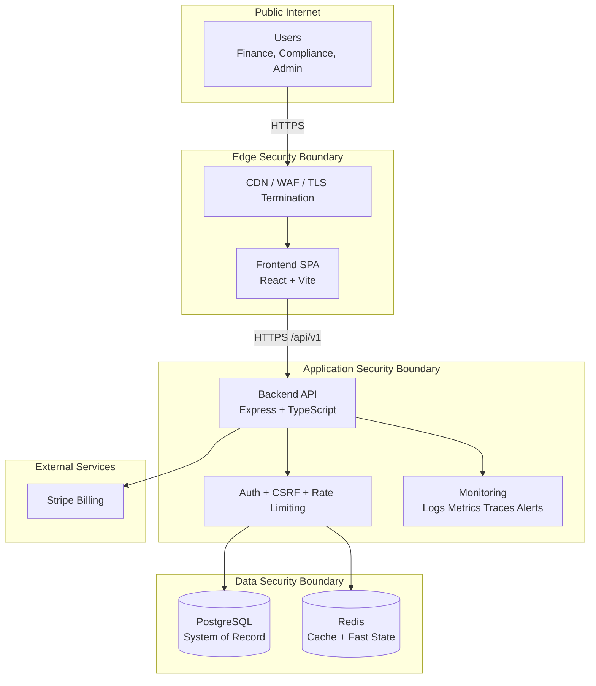
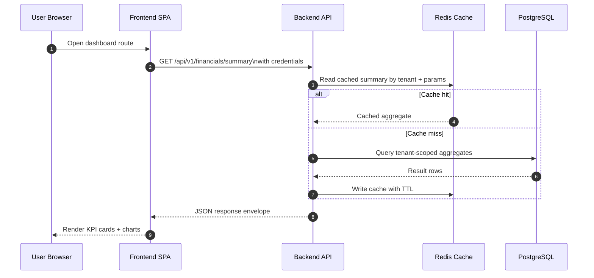
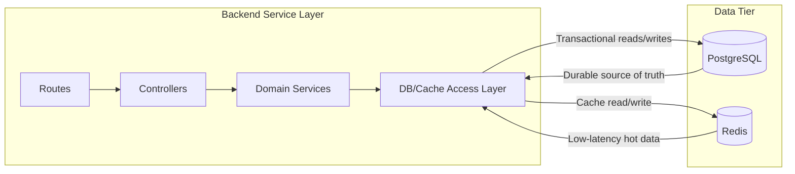
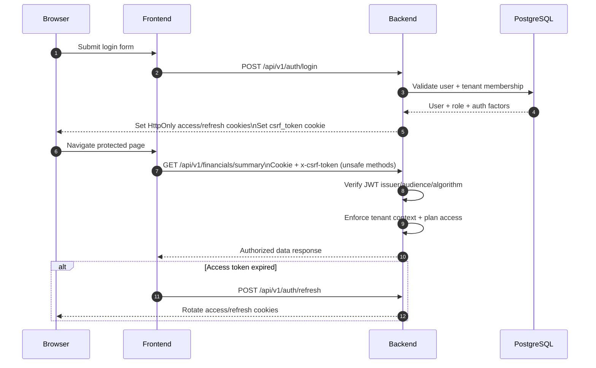
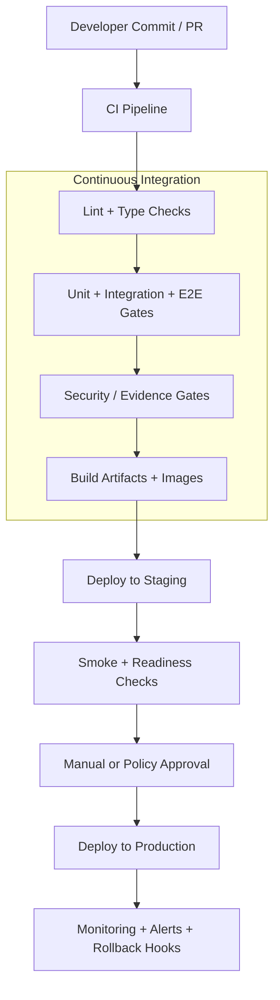
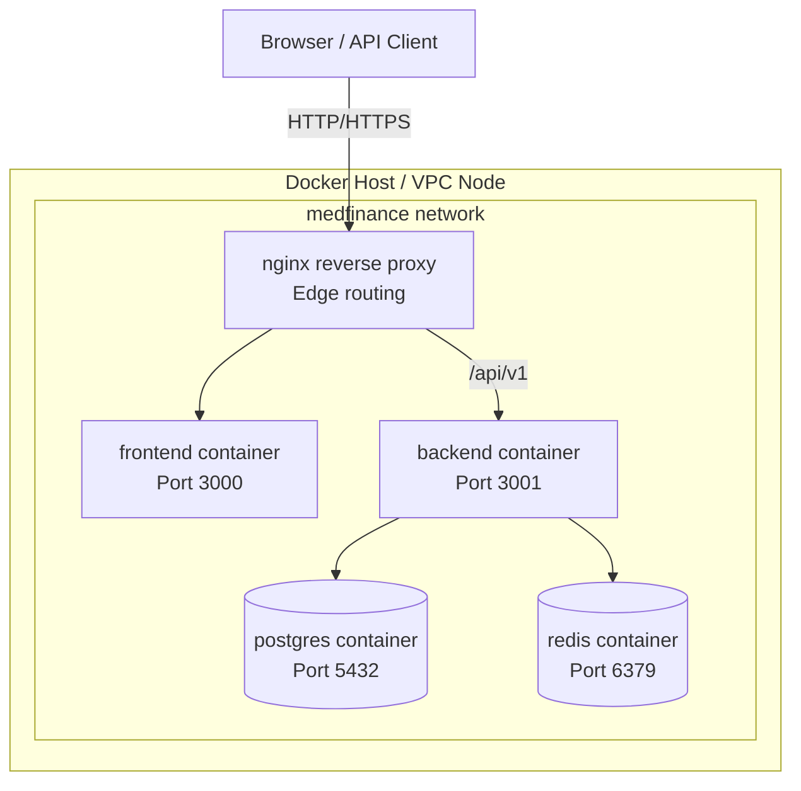
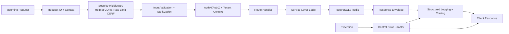
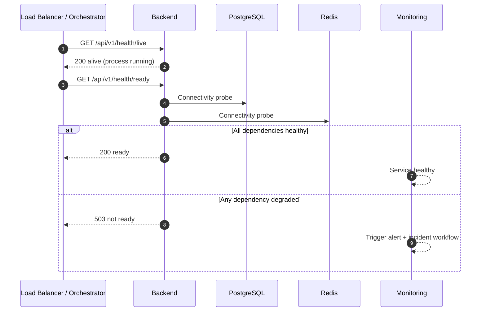

# Mermaid Architecture Diagrams

## 1) High-level system architecture

## 2) Frontend/backend interaction

## 3) Database interaction flow

## 4) Authentication flow

## 5) CI/CD pipeline

## 6) Docker container topology

## 7) Request lifecycle

## 8) Health check and readiness flow

