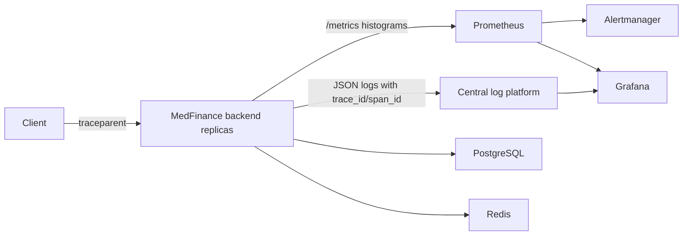

# Production Observability Architecture

## 1. Observability architecture

MedFinance observability is built around OpenTelemetry-compatible telemetry semantics and Prometheus-native aggregation:

- **Application instrumentation** emits bounded-cardinality RED metrics for every HTTP request and dependency metrics for PostgreSQL and Redis.
- **Prometheus** scrapes `/api/v1/internal/observability/metrics` from every backend instance and performs fleet-wide aggregation with `sum(rate(...))` and `histogram_quantile(...)`.
- **Histograms, not process-local percentiles**, are the source of latency SLOs. Percentiles are calculated at query time from Prometheus buckets so they remain valid across rolling deploys and multiple replicas.
- **Distributed trace context** is always propagated with W3C `traceparent` and `x-trace-id` response headers. Logs include `trace_id`, `span_id`, and `trace_sampled` fields for trace/log correlation.
- **Dashboards and alerts are code** under `infrastructure/observability` and should be promoted through the same review path as application changes.

Recommended production flow:



## 2. Metrics design

### HTTP RED metrics

| Metric | Type | Labels | Purpose |
| --- | --- | --- | --- |
| `http_server_requests_total` | Counter | `method`, `route`, `status_code`, `status_class`, `outcome` | Request and error rates. |
| `http_server_request_duration_seconds` | Histogram | `method`, `route`, `status_code`, `status_class`, `outcome`, `le` | Request duration distribution for p50/p95/p99. |

`route` uses normalized Express route templates or normalized paths, replacing numeric and UUID path segments with `:id` to avoid high-cardinality label explosions.

### PostgreSQL dependency metrics

| Metric | Type | Labels | Purpose |
| --- | --- | --- | --- |
| `db_client_queries_total` | Counter | `db_system="postgresql"`, `operation`, `status` | Query throughput and query error ratio. |
| `db_client_query_duration_seconds` | Histogram | `db_system="postgresql"`, `operation`, `status`, `le` | Query latency by SQL operation. |

The application labels SQL with a coarse operation (`SELECT`, `INSERT`, `UPDATE`, etc.) rather than raw statements, table names, tenant IDs, or parameters.

### Redis dependency metrics

| Metric | Type | Labels | Purpose |
| --- | --- | --- | --- |
| `redis_client_operations_total` | Counter | `db_system="redis"`, `operation`, `status` | Redis operation throughput and error ratio. |
| `redis_client_operation_duration_seconds` | Histogram | `db_system="redis"`, `operation`, `status`, `le` | Redis latency by command family or wrapper operation. |

### Multi-instance queries

Use these examples in dashboards and alerts:

```promql
sum(rate(http_server_requests_total[5m]))
```

```promql
sum(rate(http_server_requests_total{outcome="error"}[5m]))
/
clamp_min(sum(rate(http_server_requests_total[5m])), 0.001)
```

```promql
histogram_quantile(
  0.95,
  sum by (le, route, method) (rate(http_server_request_duration_seconds_bucket[5m]))
)
```

## 3. Tracing implementation

The backend creates or continues W3C trace context for every request:

- If an inbound `traceparent` header is valid, the backend preserves the trace ID and creates a server span ID.
- If no valid context exists, the backend creates a new trace ID and span ID.
- Responses include `traceparent` and `x-trace-id` headers.
- Structured logs automatically include `trace_id`, `span_id`, and `trace_sampled` when emitted within request context.

### Production-safe sampling guidance

- Default to parent-based ratio sampling: `OTEL_TRACES_SAMPLER=parentbased_traceidratio`.
- Start at `OTEL_TRACES_SAMPLER_ARG=0.10` for normal production traffic.
- Increase temporarily during incident response for a narrow service or route; avoid fleet-wide `1.0` sampling unless traffic is low and storage budgets are confirmed.
- Always preserve upstream sampling decisions so an edge gateway or synthetic monitor can force sampling for critical probes.
- Never attach PHI, JWTs, SQL parameters, card data, tenant names, or user emails to spans or metric labels.

## 4. Alert rules

Alert rules live in `infrastructure/observability/prometheus/rules/medfinance-alerts.yml` and cover:

- Backend scrape target down.
- 5xx error ratio above the availability SLO burn threshold.
- Route-level p95 latency above the latency SLO threshold.
- PostgreSQL query error ratio.
- Redis operation error ratio.

Prometheus loads rules from `/etc/prometheus/rules/*.yml`; mount the repository `infrastructure/observability/prometheus/rules` directory into that path in production.

## 5. Grafana dashboards

The dashboard definition lives at `infrastructure/observability/grafana/dashboards/medfinance-overview.json` and includes:

- Request rate, error ratio, p95 latency, and 30-day availability SLO views.
- Route and method filters.
- Route-level RED panels.
- PostgreSQL query rate, error, and p95 latency panels.
- Redis operation rate, error, and p95 latency panels.

## 6. SLO definitions

| SLO | Objective | Measurement | Initial alert |
| --- | --- | --- | --- |
| API availability | 99.9% successful non-5xx requests over 30 days | `1 - 5xx / all` | Page when 5xx ratio > 2% for 10m. |
| API latency | 95% of requests under 1.5s over 30 days | Prometheus histogram p95 by route | Ticket when route p95 > 1.5s for 10m. |
| PostgreSQL reliability | 99.9% successful queries over 30 days | `1 - db errors / all db queries` | Page when DB query error ratio > 1% for 5m. |
| Redis reliability | 99.5% successful Redis operations over 30 days | `1 - redis errors / all redis ops` | Ticket when Redis error ratio > 2% for 5m. |

## 7. Operational error taxonomy

| Class | Examples | Telemetry mapping | Operator action |
| --- | --- | --- | --- |
| `client_error` | Validation failure, unauthorized, forbidden, not found | HTTP `4xx`, `outcome="client_error"` | Monitor trends; page only for abuse/security patterns. |
| `server_error` | Unhandled exception, dependency outage, invariant violation | HTTP `5xx`, `outcome="error"` | Page when SLO burn threshold is exceeded. |
| `dependency_db_error` | Query timeout, connection failure, migration incompatibility | `db_client_queries_total{status="error"}` | Check DB availability, pool saturation, migrations, and slow queries. |
| `dependency_cache_error` | Redis timeout, auth failure, connection reset | `redis_client_operations_total{status="error"}` | Check Redis health, TLS/auth, memory pressure, and network path. |
| `security_error` | CSRF, CORS, tenant context enforcement | HTTP `403` plus application error code | Investigate spikes; preserve audit context. |
| `operational_shutdown` | Graceful shutdown, readiness removal | HTTP `503` with shutdown code | Confirm rollout or autoscaling event. |

## Rollout checklist

1. Deploy backend changes with `/metrics` protected by operational access controls.
2. Scrape every backend replica directly; do not scrape through public Nginx.
3. Load Prometheus rule files and validate with `promtool check rules`.
4. Provision the Grafana dashboard JSON.
5. Confirm log pipeline indexes `trace_id` and `span_id`.
6. Run a synthetic request with a known `traceparent` and verify the same `trace_id` appears in response headers and logs.
